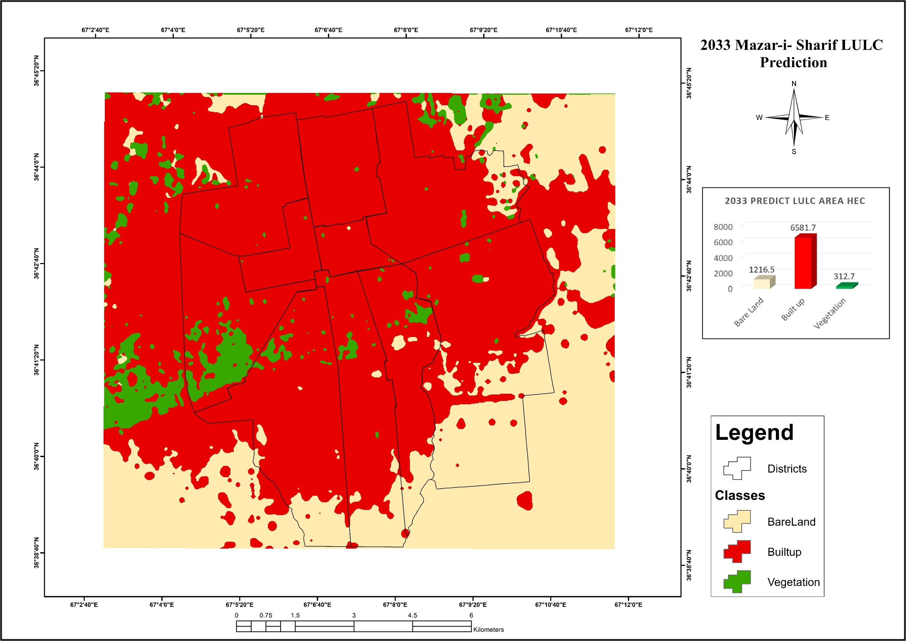
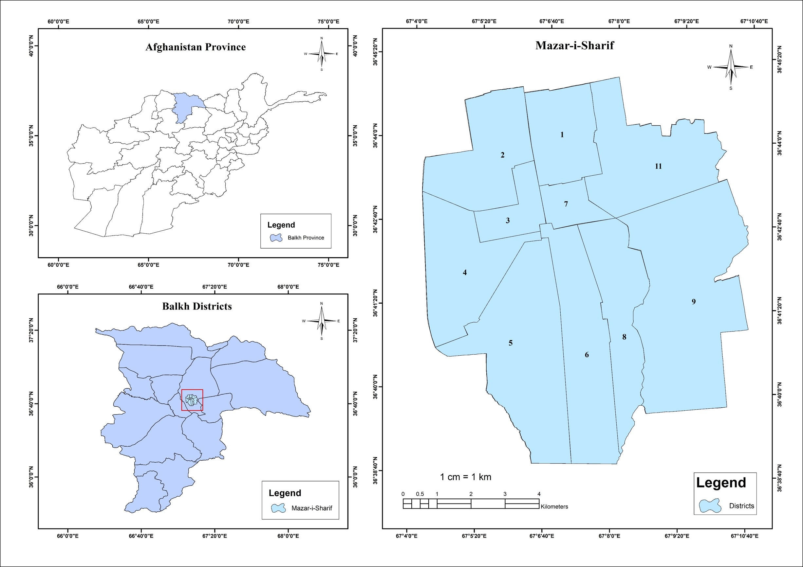
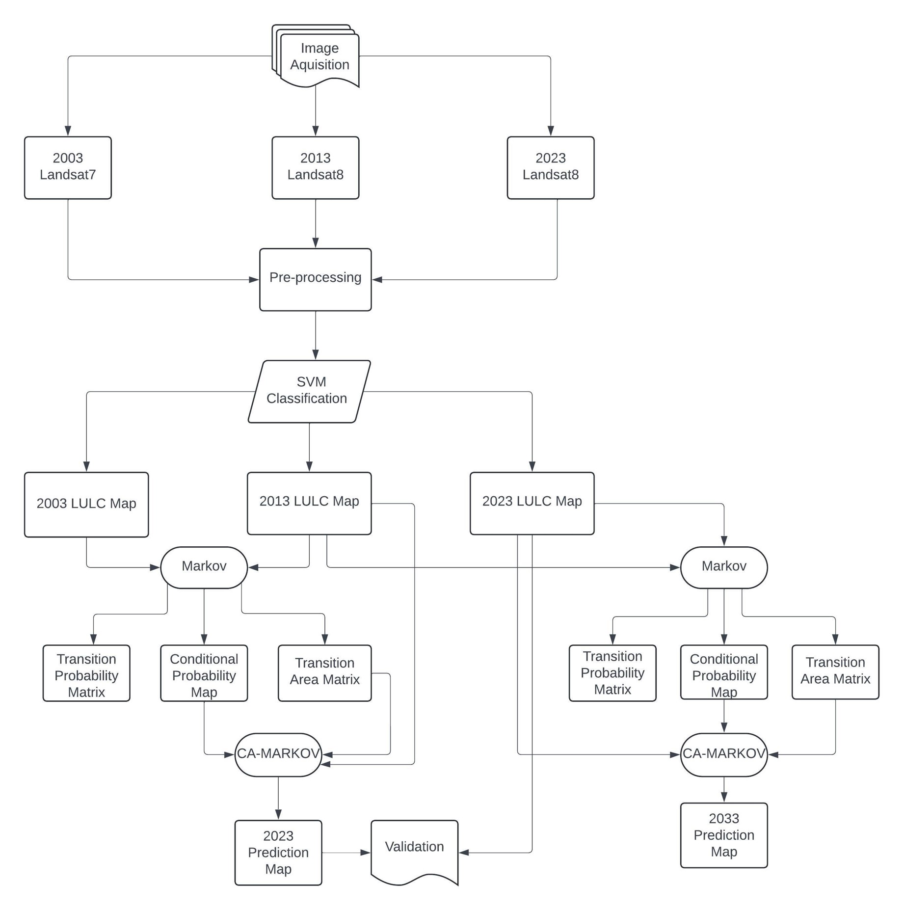
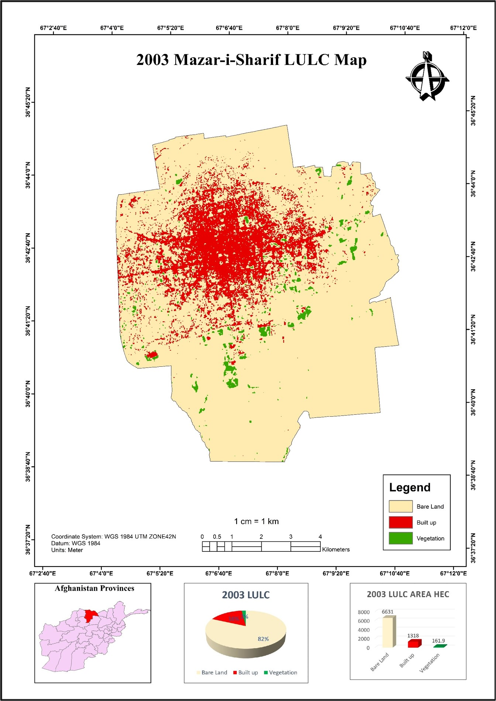
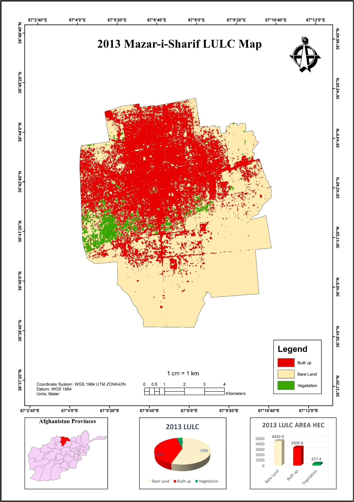
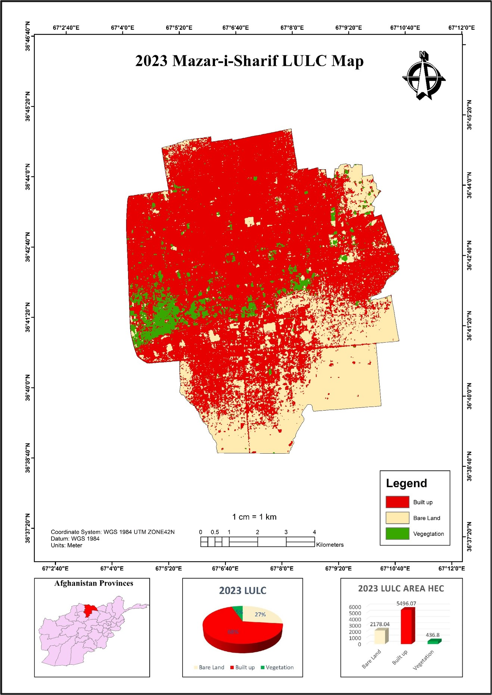
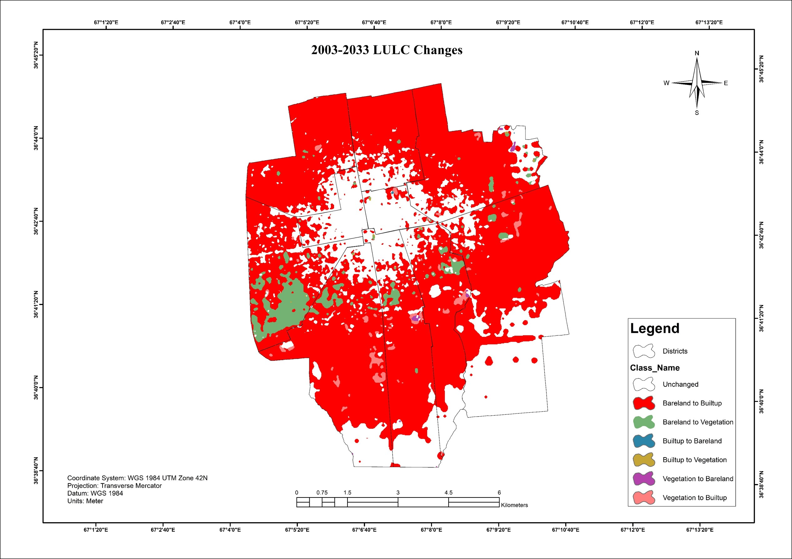
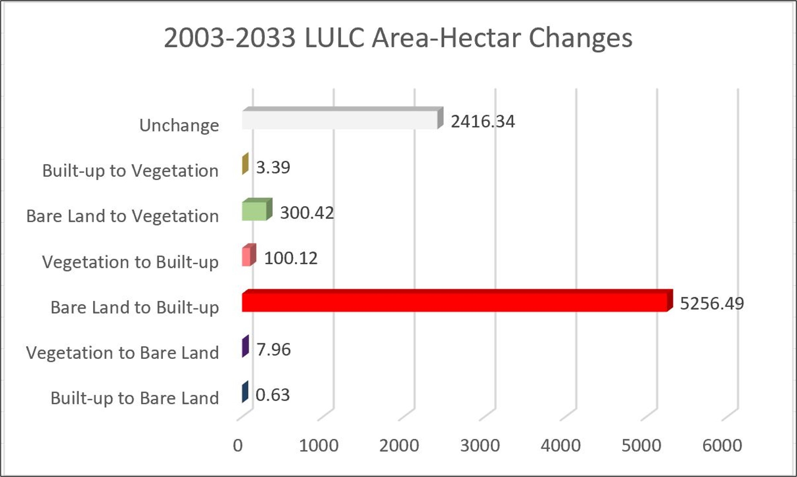
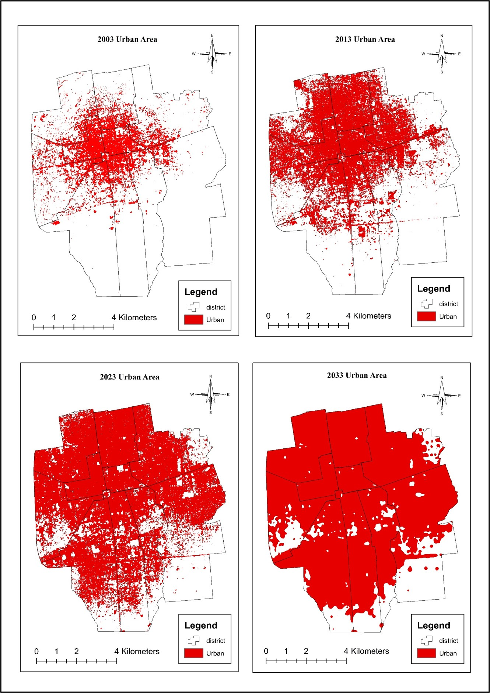
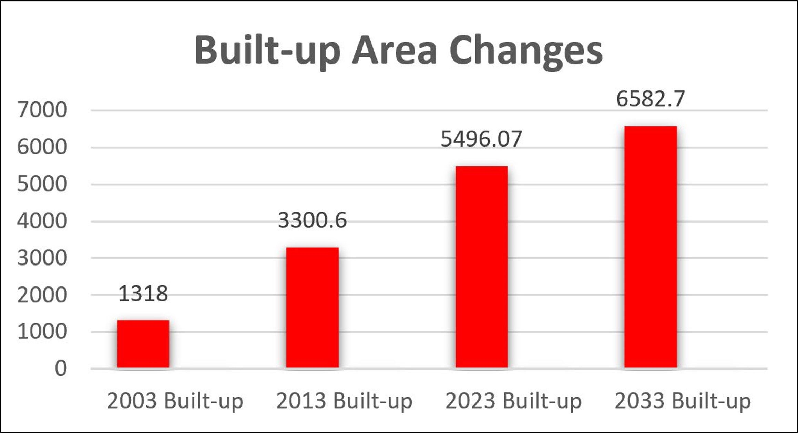

# Urban Growth Prediction of Mazar-e-Sharif City Using an Integrated Cellular Automata and Markov Chain Model

> Analysis of 20 years of urban expansion in Mazar-e-Sharif (2003-2023) from Landsat imagery, and a simulation of likely built-up growth to 2033 using a CA-Markov model.

  

---

## Table of Contents
- [Overview](#overview)
- [Key Findings](#key-findings)
- [Study Area](#study-area)
- [Objectives](#objectives)
- [Data](#data)
- [Methodology](#methodology)
- [Results](#results)
- [Model Validation](#model-validation)
- [Limitations](#limitations)
- [Software](#software)
- [Author](#author)

---

## Overview

Mazar-e-Sharif, in Balkh Province in northern Afghanistan, is one of the country's largest and fastest-growing cities. This project maps how its built-up area changed between **2003 and 2023** using multi-temporal Landsat imagery and projects its likely extent in **2033** with an integrated **Cellular Automata-Markov Chain (CA-Markov)** model.

The Markov Chain component estimates how much land is likely to change from one class to another. The Cellular Automata component decides where that change is most likely to occur, based on suitability and neighborhood effects. Together they give a spatially explicit picture of future urban expansion.

This work was developed as a bachelor's thesis in GIS and Remote Sensing at Kabul Polytechnic University.

---

## Key Findings

| Year | Built-up area (ha) | Change from previous period | Average growth (ha/year) |
|------|-------------------:|----------------------------:|-------------------------:|
| 2003 | 1,318.00 | n/a | n/a |
| 2013 | 3,300.60 | +1,982.60 ha (+150.4%) | about 198 |
| 2023 | 5,496.07 | +2,195.47 ha (+66.5%) | about 220 |
| 2033 (predicted) | 6,582.70 | +1,086.63 ha (+19.8%) | about 109 |

- Built-up area grew **more than four-fold** (about 317%) between 2003 and 2023.
- Between 2003 and 2023 the city added roughly **4,178 ha** of built-up land.
- The model projects continued expansion to about **6,583 ha** by 2033, at a slower pace than in the past two decades. This reflects the transition probabilities from past change, not a forecast of policy, economic or security conditions.

---

## Study Area

**Mazar-e-Sharif**, Balkh Province, Afghanistan.

---

## Objectives

- Analyze historical urban expansion (2003-2023)
- Identify land-use/land-cover (LULC) changes
- Model future urban growth with CA-Markov
- Visualize spatial patterns of expansion

---

## Data

| Dataset | Description | Source |
|---------|-------------|--------|
| Landsat imagery | Multi-temporal satellite scenes for 2003, 2013 and 2023 | USGS / Earth Explorer |
| LULC maps | Classified from the Landsat imagery | Produced in this study |
| Administrative boundary | City / study area boundary | UN Habitat |

<!-- TODO: list the Landsat sensors and acquisition dates (e.g. Landsat 7 ETM+ / 8 OLI), spatial resolution (30 m), the LULC classes, and any driver/suitability layers used (distance to roads, slope, etc.). -->

---

## Methodology

1. **Satellite image preprocessing**: preparing and clipping the Landsat scenes to the study area.
2. **LULC classification**: classifying each date into land-cover classes.
3. **Change detection**: quantifying gains and losses between dates.
4. **Markov Chain analysis**: calculating transition probabilities between classes.
5. **Cellular Automata modeling**: allocating the projected change spatially.
6. **2033 prediction**: producing the simulated land-cover map.

<!-- TODO: add the CA-Markov settings: base years used for the Markov matrix, number of iterations, contiguity filter size (e.g. 5x5), and the driver/suitability layers and how they were built. -->

---

## Results

### LULC maps (2003, 2013, 2023)

### LULC changes

### LULC change chart

### Predicted urban extent in 2033

### Urban growth trend

### Urban growth trend chart

---

## Model Validation

<!-- TODO: fill in. CA-Markov results are only credible with validation. A common approach: simulate a known year (e.g. predict 2023 from 2003 and 2013) and compare it with the actual 2023 map. -->

| Metric | Value |
|--------|-------|
| LULC classification overall accuracy | 90.6 |
| LULC classification Kappa | 0.82 |
| Simulation vs. actual 2023 (Kappa / Overall) | 0.80 / 87 | 

---

## Limitations

- The prediction is a **modeled scenario**. It assumes future change follows the historical transition patterns and the model's assumptions.
- Policy changes, master plans, economic conditions, population movement and security conditions are not represented in the model.
- Classification accuracy of the Landsat-derived maps (30 m resolution) affects the transition probabilities and the final simulation.
- Mixed pixels in a dense urban fringe can cause confusion between built-up, bare land and agriculture.

---

## Software

- **ArcGIS Pro**: mapping, spatial analysis and layout
- **TerrSet / IDRISI (CA-Markov)**: Markov Chain and Cellular Automata modeling
- **ENVI**: image preprocessing and classification

---

## Author

**Hamayon Muradi**
GIS and Remote Sensing graduate, Kabul Polytechnic University

- GitHub: [@hamayonmuradi](https://github.com/hamayonmuradi)
- Email: hamayonmuradi8@gmail.com

